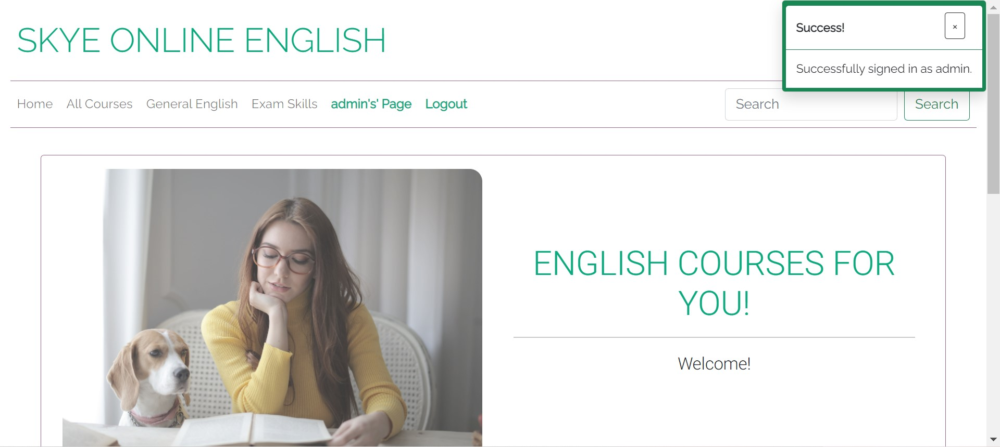
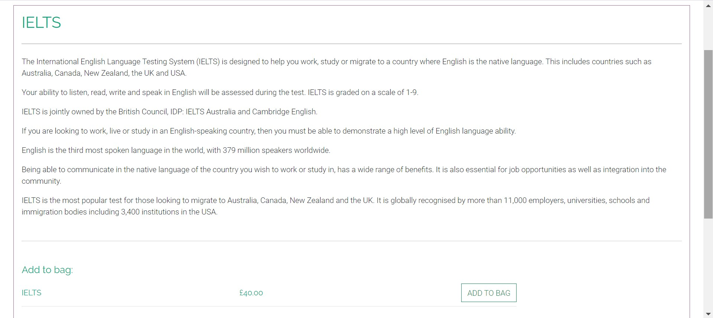
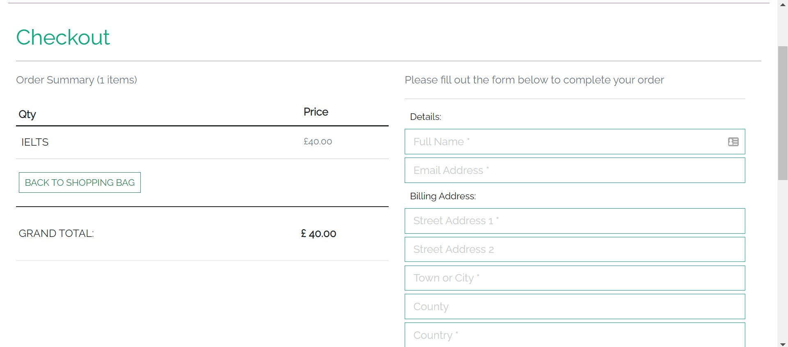
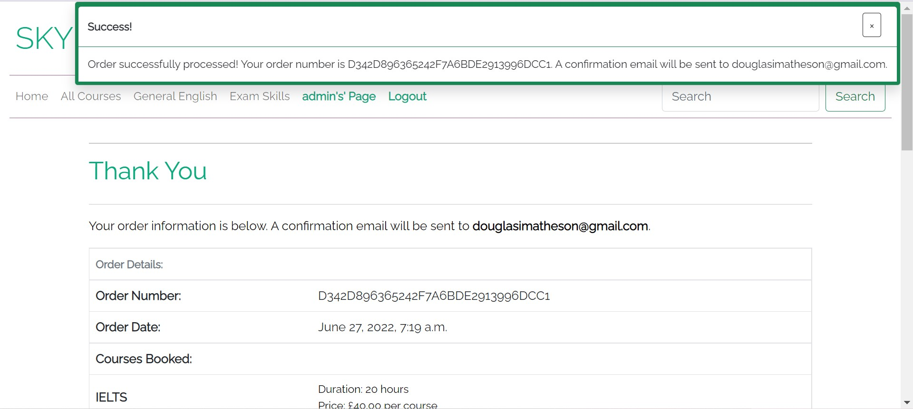
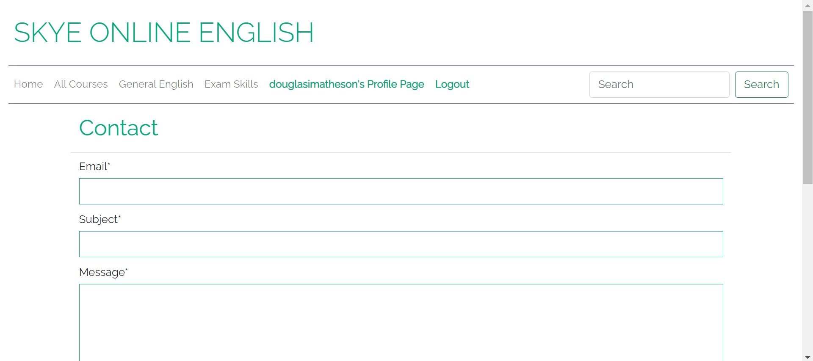
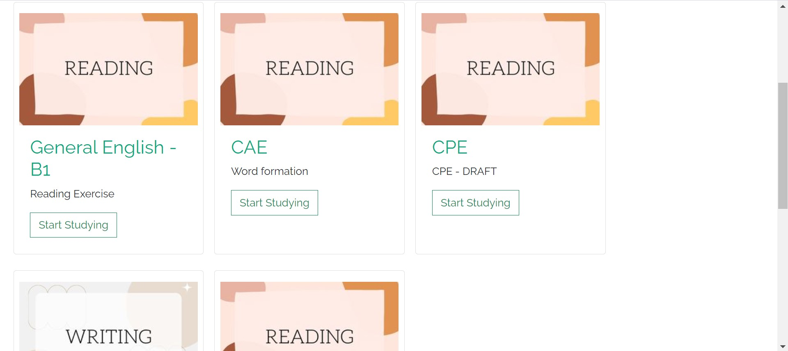

# Skye Online English (Shop + LMS)


[Skye Online English](https://www.skyeonlineenglish.com/) is an online English language teaching site.  It is currently focussed on providing face-to-face teaching.  This project intends to provide self-study opportunities for langauge students.  Similarly to sites like Udemy, this project aims to provide lifetime access for single purchases.

## Business Model

Currently, Skye Online English is running and is under the ownership of a sole trader (who happens to be the developer of this project).  The business is **not** aiming to be the primary source of income for the owner, but rather secondary.  Therefore, there is no budget available for marketing.  

Free marketing strategies, such as a Facebook business page, Instagram page and regular newsletter will be the principle means of communicating with potential new clients.  At time of creation, there is alread a Facebook and Instagram page (more about this further down).  Regular infographics and offers can be implemented at a later date.  

A quick search using [Wordtracker](https://www.wordtracker.com/) states that many people are looking at learning English in Korean - so duplicating/translating the website with an emphasis on certain langauges is something to consider.  Certainly, newsletters should be in a number of langauges.

## Planning

User Stories - 
- As a User, I want to be able to view a list of available courses so that I can choose which one(s) to buy.
- As a User, I want to be able to sort courses by category so that I can find one more suited to my needs more quickly.
- As a User, I want to be able to view more details about a specific course so that I can make an informed decision before I purchase.
- As a User, I want to view all the items in my bag before purchasing.
- As a User, I want to be able to view the items in my bag at checkout so that I have a final chance to decide if I want to purchase.
- As a User, I want to be able to purchase items securely.
- As a User I want to be able to store my personal data so that I can use it again without having to reinput it.
- As a User, I want to be able to see all of my past purchases in order to ensure that I don't purchase something twice.
- As a User, I want to be able to register for an account to allow for quicker access at a later date.
- As a User, I want to be able to log in to see my personal data and log out when I am finished.
- As a User I want to be able to recover my password if I forget it.
- As a User, I want to be able to email the company with any questions that I may have.
- As a User, I want to be able to access my paid-for course content so that I can study.
- As a User, I would like to see my progress throughout each section of the course.
- As an Admin, I want to be able to add courses to my shop to encourage new business.
- As an Admin, I want to be able to edit/update my courses to keep them current.
- As an Admin, I want to be able to remove courses that I no longer need/want.
- As an Admin, I want to be able to view past orders to ensure there is no discrepancy between what the user bought and expected.


**Wireframes - Shop**

*Desktop*

- [Desktop View - Homepage](media/wireframes/desktop_shop/1_desktop_view_homepage.jpg)
- [Desktop View - All Courses](media/wireframes/desktop_shop/2_desktop_view_all_courses_contents_page.jpg)
- [Desktop View - Course Details](media/wireframes/desktop_shop/3_desktop_view_course_details.jpg)
- [Desktop View - Shopping Bag](media/wireframes/desktop_shop/4_desktop_view_course_shopping_bag.jpg)
- [Desktop View - Checkout](media/wireframes/desktop_shop/5_desktop_view_checkout.jpg)
**Mobile*
- [Mobile View - Homepage](media/wireframes/desktop_shop/1_mobile_view_homepage.jpg)
- [Mobile View - All Courses](media/wireframes/desktop_shop/2_mobile_view_all_courses_contents_page.jpg)
- [Mobile View - Course Details](media/wireframes/desktop_shop/3_mobile_view_course_details.jpg)
- [Mobile View - Shopping Bag](media/wireframes/desktop_shop/4_mobile_view_course_shopping_bag.jpg)
- [Mobile View - Checkout](media/wireframes/desktop_shop/5_mobile_view_checkout.jpg)

**Wireframes - LMS**
*Desktop*

- [Desktop View - LMS](media/wireframes/desktop_shop/1_lms_desktop_view.jpg)
- [Desktop View - LMS - Content](media/wireframes/desktop_shop/3_lms_content_desktop_view.jpg)

*Mobile*

- [Mobile View - LMS](media/wireframes/desktop_shop/2_lms_mobile_view.jpg)
- [Mobile View - LMS - Content](media/wireframes/desktop_shop/4_lms_content_mobile_view.jpg)

## Features



The homepage / base template allows users almost complete navigation throughout the site.  In the navigation bar there are links to:

- the homepage (current)
- all courses - a search with no filters applied
- General English - a search of all published courses with the category 'General English'
- Exam Skills - a search of all published courses with the ctegory 'Exam Skills'
- user's Profile Page - a link to the user's order history, personal details and link to the LMS
- Manage Content (superusers only) - link to content management (lessons, shop content)
- a search bar - for searching all published courses
- a link to a contact form
- a link to the site's privacy policy (footer)
- a link to the site's terms and conditions (footer)
- social links
- signup form from Mail Chimp

**Searching / Course Results**


Here we can see the filtered search results in order of course name.  At present there are only 2 courses for testing/display purposes.


If the search results come up empty, users will see this message.


**Course Details**



In the course details page the user can see much more infromation about a course than in the search results.  This image has been zoomed out to 67% to show the 'Add to Bag' feature.  Users can only add it to their shopping if it has not been added already, and if it has not been bought before.  

**Shopping Bag**


In the shopping bag, users can review all the courses they wish to purchase and remove items.

**Checkout**



Users can purchase their courses here.  The payment system is Stripe.  Users can enter their billing address here and save it to their profile for faster checkout next time.  

**Post Checkout**



This page will provide the user with a summary of what has just been purchased.  There will be a copy of this available in the user's profile page.

**Personal Profile**


On this page will be a list of all the user's past orders along with their saved address.  This is also where the user will be able to access the LMS.  This was placed in here intentionally as opposed to in the navigation bar as the principle purpose of this site is to make money so the inital links are for business purposes.

**Contact**



Users can contact the company with questions/comments.  This message will be stroed in a database as opposed to being sent to an email address.

**LMS**



Users who have purchased courses will see their individual course lessons displayed here.  They are categorised alphabetically by course name.  Should a user have purchased a course, but then a lesson is added/updated, it will automatically appear here.

**LMS Content**

Part 1:

Part 2:

Part 3:

Part 4:


Each lesson in the LMS is divided into 4 sections and has a progress bar along the bottom.
- Section 1 is designed to give an overview of the question - Is it a multiple choice question, or is at an exam skill?
- Section 2 is designed to give a sampl question to allow the user an opportunity to try the question before reading the guide.
- Section 3 is a guide to explain how to complete the question.  There is an option to include a video here.
- Section 4 is for further information/study.  There is an option to upload pdfs - currently using [Cloudinary](https://cloudinary.com/).

I will explain the fields later on when I share the admin side of the LMS.

**Manage**

I have a made a control panel of sorts where the admin user can add content to the site/lms.


The admin can access each section by clicking the arrow on the right of the screen.  Users have a profile page where they can access their order history, whereas admins will have this page appear in its stead. 

**Manage New Content**


We have three sections here:

- add a new course category
- add a new lesson
- add a new course to the shop

**Add a New Course Category**


The course category is something that is self-explanatory to the target audience (workers in the English as a Second Langauge industry).  This would be, for example, 'IELTS', 'CAE' or perhaps 'General English - B2'.  If the intended lesson is for an exisiting category, then this step can skipped.

**Add a New Lesson**


The lesson is the nuts and bolts of the LMS.  New academic content is added here.  

The large fields are SummerNote widgets which can allow the user to style the content as they wish.  The CSS file takes into account bold tags and italic tags.  SummerNote does not use the more modern 'strong' and 'em' tags, so a later development could be to use a different wysiwyg editor.

There is an option to include a video if wished as youtube already contains a lot of videos regarding efl content.  

Finally there is an opportuntiy to include 2 PDF files.  These are currently ebing uploaded to Cloudinary and will open in a new window. 

**Add New Course to Shop**


If the user has created lessons for a brand new course, users will not be able to access the content until after a purchase is made - thus a new course must be added to the shop.

As above, the textfields all use SummerNote.  

**Editing Lessons**


From the Manage page, there is an option to edit existing lessons.  This can allow users to keep the content current and to fix any errors that may be discovered post publishing.


From the Manage page, there is an option to edit existing items in the shop.  This can allow users to keep the content current and to fix any errors that may be discovered post publishing.

**Inbox**


An inbox was created to allow existing/potential users to contact the company.  It was decided to keep it as part of the system as opposed to sending the emails directly to an email account.  This was chosen in order to keep everything together to avoid mismanaging of information across platforms.  


If the comapny wishes to reply, they will need a seperate email account.  As a later development, if the comapny wishes, an email client could be embedded.

## Ongoing Bug discovery and fixes

| Bug No' | Issue | Fix |
|---|---|---|
| 1 | Database isn't connecting and error was displaying in terminal stating 'FATAL:  no pg_hba.conf entry for host "34.76.234.132", user "zfbtmtppxoejuc", database "de76aaatkpqei5", no encryption' | Heroku conducted maintenance on Postgresql database and change the database url and emailed me to inform me.  I have updated the url in my env.py file and it seems to be working fine. |
| 2 | Repeat of bug number 1 - Added new Postgresql DATABASE_URL to env.py, will request further information from mentor/slack community |   |
| 3 | Bag items are not displaying after submitting 'Add to Bag' on course detials page | bag contexts file added to settings.py |
| 4 | Profile page not rendering when function in views.py pulls data from models.py | Created brand new user, seems to work ok after. |
| 5 | embedvideo package ran locally but video wouldn't display as embedded address was changed from 'Https' to 'Http' | Added Content Security Policy to base.html meta |
| 6 | Can access certain pages without logging in | Login_required decorators added to checkout and profiles pages |
| 7 | Summernote fields aren't displaying in the UI, only in the admin| Updated forms.py accordingly |
| 8 | Customers still had access to all courses that weren't paid for | Added for loop to filter course names that match what courses are bought in the user's profile |
| 9 | Customers can purchase the same thing twice but at different times| Added for loop to add_to_bag function tocompare with items already in user's profile |
| 10 | After installation of cloudinary, thumbnail images in LMS were not displaying | Changed model to Charfield and added the urls of the thumbnails in Cloudinary |
|11|Superusers do not have access to courses unless they purchase them|Wrapped view code for LMS content in if statement|
|12|PDF file were not downloading from lms|Cloudinary free account prevents sending PDF and ZIP files, updated cloudinary settings.|

## Testing

### Manual Testing

There was no automated testing carried out during this project. Each User Story was manually tested as follows:

### User Stories

**As a User, I want to be able to view a list of available courses so that I can choose which one(s) to buy.**

|**Test**|**Result**|**Verdict**|
|---|---|---|
|Entered the site's url|Homepage displays correctly|-|
|Selected 'All courses' from the nav bar|A list of all (2 for development purposes) display in the form of cards|**PASS**|
|Selected 'All courses' from the footer|A list of all (2 for development purposes) display in the form of cards|**PASS**|

**As a User, I want to be able to sort courses by category so that I can find one more suited to my needs more quickly**.

|**Test**|**Result**|**Verdict**|
|---|---|---|
|Entered the site's url|Homepage displays correctly|-|
|Selected 'General English' from the nav bar|An error displays stating that there are no general English courses available at this time|**PASS**|
|Selected 'General English' from the footer|An error displays that there are no courses that match this search|**PASS**|
|Selected 'Exam Skills' from the nav bar|The two exam skills courses display correctly|**PASS**|
|Selected 'Exam Skills' from the footer|The two exam skills courses display correctly|**PASS**|
|Entered an exam name (IELTS) into the search bar|Only the IELTS course displayed|**PASS**|
|Entered 'English' into the search bar|Both courses displayed|**PASS**|
|Entered 'Cake'|An error displays that there are no courses that match this search|**PASS**|


**As a User, I want to be able to view more details about a specific course so that I can make an informed decision before I purchase.**

|**Test**|**Result**|**Verdict**|
|---|---|---|
|Entered the site's url|Homepage displays correctly|-|
|Selected 'All courses' from the nav bar|A list of all (2 for development purposes) display in the form of cards|-|
|Selected 'More Details' fromm the bottom of the course cards|A new page opened up with more information about the specific course I selected.|**PASS**|
|Returned to 'All courses' and selected 'More Details' on a differernt course|A new page opened up with more information about the specific course I selected.|**PASS**|

**As a User, I want to view all the items in my bag before purchasing.**

|**Test**|**Result**|**Verdict**|
|---|---|---|
|Entered the site's url|Homepage displays correctly|-|
|Selected 'All courses' from the nav bar|A list of all (2 for development purposes) display in the form of cards|-|
|Selected 'More Details' fromm the bottom of the course cards|A new page opened up with more information about the specific course I selected.|-|
|Selected 'Add to Bag'|Page refreshes and displays message stating that the item was successfully added, link appears at the bottom of the page with bag total|-|
|Returned to 'All courses' and selected 'More Details' on a differernt course|A new page opened up with more information about the specific course I selected.|-|
|Selected 'Add to Bag'|Page refreshes and displays message stating that the item was successfully added, link appears at the bottom of the page with bag total|-|
|Clicked on 'View Bag' at the base of page|Directed to 'Shopping Bag' page where I can see both of the items that I added|**PASS**|

**As I User, I want to be able to view the items in my bag at checkout so that I have a final chance to decide if I want to purchase.**

|**Test**|**Result**|**Verdict**|
|---|---|---|
|Repeated steps above to add items to bag|Directed to Shopping bag page|-|
|Clicked on 'Secure Checkout' button|Directed to checkout page where user can pay for items||
|Button to return to Shopping Present|||
|Clicked button to return to Shopping Bag|Directed back to shopping bag where I can adjust the items|**PASS**|

**As a User, I want to be able to purchase items securely.**

|**Test**|**Result**|**Verdict**|
|---|---|---|
|Repeated steps above to add items to bag|Directed to Shopping bag page|-|
|Clicked on 'Secure Checkout' button|Directed to checkout page where user can pay for items||
|Filled in personal details and added Stripe Test number from Stripe documentation.  Clicked on 'Complete Payment|Overlay loads asking user to wait||
|On completion of payment, page directs to 'Order Confirmation' page and displays message confirming purchase has been made||**PASS**|
|Accessed Stripe Dashboard|Accessed webhooks in Stripe's dashboard to confirm if payment was successful. Stripe shows response code 200 for payment intent, charges and balance|**PASS**|

**As a User I want to be able to store my personal data so that I can use it again without having to reinput it.**

|**Test**|**Result**|**Verdict**|
|---|---|---|
|Repeated above steps to make a purchase but ensure that 'Remember my Details is selected|On successful payment, address is shown in order confirmation page||
|Clicked 'User's Profile Page'in nav bar|Address entered is displayed as it was entered in checkout|**PASS**|
|Accessed User Profile in admin panel|Address is displayed correctly|**PASS**|

**As a User, I want to be able to see all of my past purchases in order to ensure that I don't purchase something twice.**

|**Test**|**Result**|**Verdict**|
|---|---|---|
|After making a purchase, I clicked on 'User's Profile Page'|Past order(s) displayed in a table||
|I clicked on the order number of my purchase|Directed to a copy of the order confirmation page for the order in question|**PASS**|
- **NOTE**: the function to add items to the shopping bag has also been modified to compare against past orders.  It is not possible for the user to add a course to the bag if it has already been purchased.  An error will display if the user tries to do so.


**As a User, I want to be able to register for an account to allow for quicker access at a later date.**
&
**As a User, I want to be able to log in to see my personal data and log out when I am finished.**

|**Test**|**Result**|**Verdict**|
|---|---|---|
|Clicked 'Sign Up' in the nav bar|Directed to sign-up page||
|*Duplicate Email*|||
|Attempted to sign up using an email which already has an account|Page refreshes and error states: A user is already registered with this e-mail address.|**PASS**|
|*Duplicate Username*|||
|Attempted to sign up with a username that already exists|Page refreshes and error states: A user with that username already exists.|**PASS**|
|*New User*|||
|Added unique username and email address|Received email asking to confirm that I have signed up||
|Clicked link in email|Directed to page asking for further confirmation||
|Clicked confirm|Redirected to Log In page with message confirming that an account was set up||
|Entered new username and password|Logged in Succesfully|**PASS**|
|*Log Out*|||
|After signing up and logging in, clicked on logout button in nav bar|Directed to page asking if I want to sign out||
|Clicked sign out|logged out of site, directed to home page with options to sign up and log in present in nav bar|**PASS**|

**As a User I want to be able to recover my password if I forget it.**

|**Test**|**Result**|**Verdict**|
|---|---|---|
|Entered site url and clicked 'Log In'|Directed to log in page||
|Clicked 'Forgot Password' below login form|Directed to a screen requesting email address||
|Entered email address and clicked 'Reset my Passord'|An email was sent to the email address I entered||
|Email contains a link to reset passsword, clicked it|Directed to screen asking for new password||
|Entered 2 different passwords to test|Page refreshes telling me that they need to be the same|**PASS**|
|Entered 2 passwords that are the same|Page refreshes confirming that I have changed my password successfully||
|Navigated to log in screen to log in with new password|Logged in successfully|**PASS**|

**As a User, I want to be able to email the company with any questions that I may have.**

|**Test**|**Result**|**Verdict**|
|---|---|---|
|Entered site url and clicked on 'Get In Touch'|Directed to a contact form||
|Entered data into form correctly and clicked 'Submit'|Page refreshed and a message displayed stating that the email was sent||
|Logged in as an Admin and clicked on 'Admin's Profile'|||
|Clicked on 'Go to Inbox'|The email that was sent has been received and is stored here|**PASS**|
|Returned to contact form and attempted to submit an incomplete form. Clicked 'Submit'|Form will not submit and cursor jumps to where error is|**PASS**|

**As a User, I want to be able to access my paid-for course content so that I can study.**

|**Test**|**Result**|**Verdict**|
|---|---|---|
|Attempt to access course without purchasing|||
|New User|||
|Logged in a clicked on profile page. |||
|Clicked 'Open LMS'|Directed to a screen stating 'You haven't bought any courses yet.'|**PASS**|
|Via URL - if user not authenicated|||
|Entered URL of course in LMS|Redirected to login page|**PASS**|
|Via URL - if user is authenticated|||
|Entered URL of course that has not been purchased|Directed to LMS page with error stating that course has not been purchased|**PASS**|
|Attempt to access course post-purchase|||
|Logged in a clicked on profile page. |||
|Clicked 'Open LMS'|Directed to a screen with all purchased courses/lessons |**PASS**|
|Clicked on 'Start Studying'| Lesson opens correctly |**PASS**|

**As a User, I would like to see my progress throughout each section of the course.**

|**Test**|**Result**|**Verdict**|
|---|---|---|
|Logged into the LMS|||
|Chose lesson to study|At the bottom of the content is a blue bar showing my progress|**PASS**|

**As an Admin, I want to be able to add courses to my shop to encourage new business.**

|**Test**|**Result**|**Verdict**|
|---|---|---|
|Logged into site as superuser|'Profile Link' is now showing as admin's (signed in superuser) page||
|Clicked admin's Page|Directed to 'Manage Content' page||
|Clicked the arrow beside 'Add New Content'|3 options appear: Add a New Course Category, Add A New Lesson, Add New Course to the Shop ||
|*Add a New Course Category*|||
|Clicked button stating 'Add a New Course Category'|Directed to single firled form asking for a unique form category||
|Entered IELTS as form category| Error appears in corner stating that the lesson category cannot be added|**PASS**|
|Entered new category 'cake'|page redirected to 'manage' with confirmation that category has been added.  Logged into django admin to confirm.|**PASS**|
|*Add A New Lesson*|||
|Completed form adding test content in each field|||
|Returned to 'manage' and clicked on the arrow beside 'Edit Lesson Content'|New lesson is displayed on list of lessons||
|Clicked 'View Lesson' next to the added lesson|Lesson opens in LMS content|**PASS**|
|Completed form adding test leaving out required fields|Form will not submit if a required field is not filled and the cursor will jump to the problematic field|**PASS**|
|*Add New Course to the Shop*|||
|Completed form adding test content in each field|||
|Returned to 'manage' and clicked on the arrow beside 'Edit Shop Content'|New shop content is displayed on list of shop courses|**PASS**|
|Clicked on Exam Skills |Can see new course on display in shop|**PASS**|
|Completed form adding test leaving out required fields|Form will not submit if a required field is not filled and the cursor will jump to the problematic field|**PASS**|

- NOTE, it was decided not to give end users the ability to remove lesson categories in the UI as the potential for deleting more content than anticipated is high.  This feeature is to remain in the django admin.

**As an Admin, I want to be able to edit/update my courses to keep them current.**

|**Test**|**Result**|**Verdict**|
|---|---|---|
|Logged into site as superuser|'Profile Link' is now showing as admin's (signed in superuser) page||
|Clicked admin's Page|Directed to 'Manage Content' page||
|Clicked on the arrow next to 'Edit Lesson Content'|Displays a dropdown list of all lessons and all courses||
|Clicked 'Edit Lesson' next to the lesson I wanted to edit|Directed to a page with a similar form to the 'Add Lesson' form||
|Updated fields and clicked 'update'|Redirects to 'manage' with 'success' message displayed||
|Clicked on the arrow next to 'Edit Lesson Content' and clicked 'Edit Lesson' next to the lesson I just edited|Changes are reflected.  Logged into Django admin to confirm|**PASS**|
|Tried to remove a 'required field|Form wouldn't save and cursor jumped to problematic field|**PASS**|

**As an Admin, I want to be able to remove courses that I no longer need/want.**

|**Test**|**Result**|**Verdict**|
|---|---|---|
|Logged into site as superuser|'Profile Link' is now showing as admin's (signed in superuser) page||
|Clicked admin's Page|Directed to 'Manage Content' page||
|*Lessons*|||
|Clicked on the arrow next to 'Edit Lesson Content'|Displays a dropdown list of all lessons and all courses||
|Clicked 'Delete Lesson' next to the lesson I don't want|Page refreshes and lesson disappears from list.  Logged into Django admin to confirm.|**PASS**|
|*Shop Content*|||
|Clicked on the arrow next to 'Edit Shop Content'|Displays a dropdown list of all shop content||
|Clicked 'Course in Shop' next to the course I don't want|Page refreshes and course disappears from list.  Logged into Django admin to confirm.|**PASS**|

**As an Admin, I want to be able to view past orders to ensure there is no discrepancy between what the user bought and expected.**

|**Test**|**Result**|**Verdict**|
|---|---|---|
|Logged into Django Admin site|||
|Clicked 'Orders' in 'Checkout Section' on the left|A list of all orders is displayed|**PASS**|

- NOTE, it was decided to keep this in the Django admin site as this has the potential to be a very, very large database.

## Validation

### W3C - HTML

Every page was run through the [W3C Validation](https://validator.w3.org/) tool with the results displayed below.  I bagen with the publicly displayed pages and checked with their URLs.  For restricted pages, I used the source code on inspecting the page.

- **Homepage**: An issue originally flagged by the [ARC Toolkit](https://chrome.google.com/webstore/detail/arc-toolkit/chdkkkccnlfncngelccgbgfmjebmkmce?hl=en) stated that I needed to add a 'required' attribute to the MailChimp form.  Adding this attribut raised an error with the W3C tool stating that I was not to add the attribute.  As this form is generated by Mail Chimp, and not myself, I have chosen to leave it as it was originally written.  - [error details](media/validation/w3c/home_page_error.jpg)
- **All Courses**: [all clear](media/validation/w3c/all_courses.jpg)
- **Course Details** (a random course was chosen for this test): [all clear](media/validation/w3c/course_details.jpg)
- **Privacy Policy**: [all clear](media/validation/w3c/privacy_policy.jpg)
- **Terms and Conditions**: [all clear](media/validation/w3c/terms_and_conditions.jpg)
- **Contact**: [all clear](media/validation/w3c/contact.jpg)
- **Profile Page (user)**: [all clear](media/validation/w3c/profile_page.jpg)
- **Order History**: [all clear](media/validation/w3c/order_history.jpg)
- **Shopping Bag**: [all clear](media/validation/w3c/shopping_bag.jpg)
- **Checkout**: [all clear](media/validation/w3c/checkout.jpg)
- **Checkout Success**: [all clear](media/validation/w3c/checkout_success.jpg)
- **LMS**: [all clear](media/validation/w3c/lms.jpg)
- **LMS Content**: There are four errors connected with the EmbedVideo package.  As I cannot access the source code, I cannot fix them.  At a future date an alternative could be found/created. [Error Details](media/validation/w3c/lms_content.jpg)

Admin pages:

- **Manage**: [all clear](media/validation/w3c/manage.jpg)
- **Inbox**: [all clear](media/validation/w3c/inbox.jpg)
- **Add Lesson Category**: [all clear](media/validation/w3c/add_new_lesson_category.jpg)
- **Add Lesson**: Multiple errors connected with SummerNote widget.  As I have used the widget multiple times on this page, the errors are repeated.  However, when choosing a text based editor I tried [ckeditor](https://ckeditor.com/) and [tiny mce](https://django-tinymce.readthedocs.io/en/latest/index.html) and both had problems with funtionality.  I elected to use SummerNote as it is simple to use from a user perspective.  [Error details](media/validation/w3c/add_lesson.jpg).
- **Add Shop Category**:  Multiple errors connected with summernote as stated above.  [Error details](media/validation/w3c/add_shop_category.jpg)

---

### W3C CSS (Jigsaw)

The CSS was run through the Jigsaw Validation tool

CSS - [all clear](media/validation/w3c/css.jpg)

---

### Pep8 - Python/Django

**Bag App**

- [admin.py](media/validation/pep8/bag_app/1_bag_admin_pep8.jpg): *All Right*
- [contexts.py](media/validation/pep8/bag_app/2_bag_contexts_pep8.jpg): *All Right*
- [urls.py](media/validation/pep8/bag_app/3_bag_urls_pep8.jpg): *All Right*
- [views.py](media/validation/pep8/bag_app/4_bag_views_pep8.jpg): *All Right*

**Checkout App**
- [admin.py](media/validation/pep8/checkout_app/1_checkout_admin_pep8.jpg): *All Right*
- [apps.py](media/validation/pep8/checkout_app/2_checkout_apps_pep8.jpg): *All Right*
- [forms.py](media/validation/pep8/checkout_app/3_checkout_forms_pep8.jpg): *All Right*
- [models.py](media/validation/pep8/checkout_app/4_checkout_models_pep8.jpg): *All Right*
- [urls.py](media/validation/pep8/checkout_app/5_checkout_urls_pep8.jpg): *All Right*
- [views.py](media/validation/pep8/checkout_app/6_checkout_views_pep8.jpg): *All Right*
- [webhook_handlers.py](media/validation/pep8/checkout_app/7_checkout_webhook_handler_pep8.jpg): *All Right*
- [webhooks.py](media/validation/pep8/checkout_app/8_checkout_webhooks_pep8.jpg): *Issue -Line 43 is too long, however it was decided not to break the line of code as there is no logical place to divide it (see image)*


**Contact App**

 - [admin.py](media/validation/pep8/contact_app/1_contact_admin_pep8.jpg):   *All Right* 
 - [forms.py](media/validation/pep8/contact_app/2_contact_forms_pep8.jpg):   *All Right* 
 - [models.py](media/validation/pep8/contact_app/3_contact_models_pep8.jpg):   *All Right* 
 - [urls.py](media/validation/pep8/contact_app/4_contact_urls_pep8.jpg):   *All Right* 
 - [views.py](media/validation/pep8/contact_app/5_contact_views_pep8.jpg):   *All Right* 

**Courses App**

 - [admin.py](media/validation/pep8/courses_app/1_courses_admin_pep8.jpg):   *All Right*  
 - [forms.py](media/validation/pep8/courses_app/2_courses_forms_pep8.jpg):   *All Right*  
 - [models.py](media/validation/pep8/courses_app/3_courses_models_pep8.jpg):   *All Right*  
 - [urls.py](media/validation/pep8/courses_app/4_courses_urls_pep8.jpg):   *All Right*  
 - [views.py](media/validation/pep8/courses_app/5_courses_views_pep8.jpg):  *Issue - Line 27 is too long however as there is no logical place to break the line it was decided to keep it.*

**Home App**

 - [urls.py](media/validation/pep8/home_app/1_home_urls_pep8.jpg):   *All Right* 
 - [views.py](media/validation/pep8/home_app/2_home_views_pep8.jpg):   *All Right* 

 **LMS App**

 - [admin.py](media/validation/pep8/lms_app/1_lms_admin_pep8.jpg):   *All Right*  
 - [forms.py](media/validation/pep8/lms_app/2_lms_forms_pep8.jpg):   *All Right*  
 - [models.py](media/validation/pep8/lms_app/3_lms_models_pep8.jpg):  *Issue - There are four images that are available for selection in the Lesson model.  These images were added via url as there was an issue linking to static images in Cloudinary.  After checking the - [pep8 guide](https://peps.python.org/pep-0008/#a-foolish-consistency-is-the-hobgoblin-of-little-minds): , it was decided that using a url shortner would affect the readability of the code and thus should be left as is.*
 - [urls.py](media/validation/pep8/lms_app/4_lms_urls_pep8.jpg):   *All Right*  
 - [views.py](media/validation/pep8/lms_app/5_lms_views_pep8.jpg):   *All Right*  

**Profiles App**

 - [admin.py](media/validation/pep8/profiles_app/1_profiles_admin_pep8.jpg):   *All Right*  
 - [forms.py](media/validation/pep8/profiles_app/2_lms_forms_pep8.jpg):  *Issue* Line 33 is too long, but as there is no logical place to break the code, it was decided to leave it as is.  
 - [models.py](media/validation/pep8/profiles_app/3_lms_models_pep8.jpg):   *All Right*  
 - [urls.py](media/validation/pep8/profiles_app/4_lms_urls_pep8.jpg):   *All Right*  
 - [views.py](media/validation/pep8/profiles_app/5_lms_views_pep8.jpg):   *All Right*  

## Web Marketing

### SEO

The goal of this site is to provide English lanaguge material for students who are studying English as a second langauge. I used [Wordtracker](https://www.wordtracker.com/) to generate key words connected with 'English as a Foreign Langauge' - as this is the generally accepted name of hte industry.  The results were as follows:


The most commonly searched terms are not wholly relevant to this site.  Other searches confirmed this.  Therefore it was decided that every item in the shop would have its own dedicated Meta field which will users to add terms that are more connected to the specific course as opposed to the industry as a whole.

### Facebook

As this project is for a preexisting company (owned by the developer) a Facebook page is already in existance.  While the company was active (last post in 2020), there were regular updates providing quality infographics.  Visitors to the site would learn from these posts and also discover news about the company.

The website design was based on the color scheme of the company's logo - which you can see here:


### Email

A signup form for Mail Chimp is located in the footer of the page, so it is visibile on every page of the site for convenience.  Users only need to enter their email which will then be stored in Mail Chimp for the admins to send regular newsletters.

## Information Architecture

### Data Storage

**Checkout App - Order Model**

|**Key in Database**|**Validation**|**Type**|
|---|---|---|
|order_number|CharField|max_length=32, null=False, editable=False|
|user_profile|ForeignKey|**UserProfile**, on_delete=models.SET_NULL, null=True, blank=True, related_name='orders'|
|name|CharField|max_length=50, null=False, blank=False|
|email|EmailField|max_length=254, null=False, blank=False|
|country|CountryField|blank_label='Country *', null=True, blank=False|
|postcode|CharField|max_length=20, null=False, blank=True|
|town_or_city|CharField|max_length=40, null=True, blank=False|
|street_address1|CharField|max_length=80, null=False, blank=False|
|street_address2|CharField|max_length=80, null=True, blank=True|
|county|CharField|max_length=80, null=True, blank=True|
|phone_number|CharField|max_length=20, null=False, blank=False|
|date|DateTimeField|auto_now_add=True|
|grand_total|DecimalField|max_digits=10,decimal_places=2,null=False, default=0|
|original_bag|TextField|null=False, blank=False, default=''|
|stripe_pid|CharField|max_length=254,null=False, blank=False, default=''|

**Checkout App - OrderLineItem Model**

|**Key in Database**|**Validation**|**Type**|
|---|---|---|
|order|ForeignKey|**Order**, null=False, blank=False,on_delete=models.CASCADE, related_name='lineitems'|
|course|ForeignKey|**Course**, null=False, blank=False,on_delete=models.CASCADE|
|lineitem_total|DecimalField|max_digits=6,decimal_places=2, null=False,blank=False, editable=False|

**Contact App - Contact Model**

|**Key in Database**|**Validation**|**Type**|
|---|---|---|
|email|EmailField|blank=False|
|subject|CharField|max_length=255|
|message|TextField|blank=False|
|date|DateTimeField|auto_now_add=True|

**Course App - Category Model**

|**Key in Database**|**Validation**|**Type**|
|---|---|---|
|name|CharField|max_length=254|
|friendly_name|CharField|max_length=254, null=True, blank=True|

**Course App - Course Model**

|**Key in Database**|**Validation**|**Type**|
|---|---|---|
|category|ForeignKey|'**Category**', null=True, on_delete=models.SET_NULL, verbose_name="What is category of your lesson? It can be General English or Exam Skills."|
|name|CharField|max_length=254, verbose_name="What is the name of your course? THIS MUST BE THE SAME AS THE LESSON CATEGORY!"|
|card_description|TextField|null=True,verbose_name="What is a brief description of your course?  This will appear in the shop's search results."|
|description|TextField|null=True, verbose_name="What is a detailed description of your course?  This will appear on the course's dedicated page, so be as detailed as you like."|
|price|DecimalField|max_digits=6, decimal_places=2|
|course_length|IntegerField|null=True,|
|course_category|ForeignKey|**LessonCategory**, null=True, on_delete=models.CASCADE, verbose_name="Now choose what lessons are included in this course.  This step is very important!"|
|course_meta|CharField|blank=True, verbose_name="This field is for SEO purposes.  Please enter some tags to describe your course and separate each tag with a comma.  For example, 'IELTS, English, Exam'", max_length=50|

**LMS App - LMS Category Model**

|**Key in Database**|**Validation**|**Type**|
|---|---|---|
|name|CharField|max_length=100, unique=True, verbose_name="What is the name of the new category? (For example, IELTS, FCE, General English?) MUST BE UNIQUE and have NO PUNCTUATION"|

**LMS App - LMS Model**

|**Key in Database**|**Validation**|**Type**|
|---|---|---|
|category|ForeignKey|'**LessonCategory**', null=True, on_delete=models.CASCADE, verbose_name="Choose a category for this lesson.  If it is a new category, not in the list, you will need to create a category in the previous section first."|
|name|CharField|max_length=100, null=True|
|SectionType|TextChoices|'SectionType', 'Reading Writing Speaking Listening'|
|exam_section|CharField|blank=True, choices=SectionType.choices, max_length=20, verbose_name="If this lesson is for an exam, which section is it for?  Otherwise you can leave this blank."|
|THUMBNAIL_IMAGES| choices |[('https://res.cloudinary.com/corderoybear/image/upload/v1655371458/static/media/reading.9b0786861128.jpg', 'Reading'), ('https://res.cloudinary.com/corderoybear/image/upload/v1655371458/static/media/writing.23e6ff8e3f48.jpg', 'Writing'), ('https://res.cloudinary.com/corderoybear/image/upload/v1655371457/static/media/listening.a10f4492e111.jpg', 'Listening'), ('https://res.cloudinary.com/corderoybear/image/upload/v1655371459/static/media/speaking.8e29b8f0faba.jpg', 'Speaking'),]|
|question_image|CharField|choices=THUMBNAIL_IMAGES, default='Reading', verbose_name="What skill does the lesson relate to (for the thumbnail image)?", max_length=200|
|question_type|CharField|max_length=100, verbose_name="What kind of question is it?  Is it grammar, vocabulary or a specific exam question?"|
|question_overview|TextField|verbose_name="Section 2 - What kind of question is it?"|
|sample_question_text|TextField|verbose_name="Section 2 - Sample Passage (can be left blank)", blank=True|
|sample_question_questions|TextField|verbose_name="Section 2 - Sample Questions"|
|question_approach|TextField|verbose_name="Section 3 - Question Approach"|
|video|EmbedVideoField|blank=True, verbose_name="Section 3 - Video (can be left blank)"|
|further_study|TextField|verbose_name="Section 4 - Further Study Information"|
|upload_questions|FileField|blank=True, verbose_name="Section 4 - Further Practice Questions (PDF) (can be left blank)"|
|upload_answers|FileField|blank=True, verbose_name="Section 4 - Further Practice Questions (Answers) (can be left blank)"|

**Profile App - UserProfile Model**

|**Key in Database**|**Validation**|**Type**|
|---|---|---|
|user|OneToOneField|**User**, on_delete=models.CASCADE|
|default_phone_number|CharField|max_length=20, null=True, blank=True|
|default_street_address1|CharField|max_length=80, null=True, blank=True|
|default_street_address2|CharField|max_length=80, null=True, blank=True|
|default_town_or_city|CharField|max_length=40, null=True, blank=True|
|default_county|CharField|max_length=80, null=True, blank=True|
|default_postcode|CharField|max_length=20, null=True, blank=True|
|default_country| = CountryField|blank_label='Country *', null=True, blank=True|
|course_bought|ManyToManyField|**Course**, blank=True|


## Technologies Used

**Languages**

- [HTML5](https://en.wikipedia.org/wiki/HTML)
- [CSS](https://en.wikipedia.org/wiki/CSS)
- [Javascript](https://en.wikipedia.org/wiki/JavaScript)
- [Python version 3.2.13](https://www.python.org/)


**Libraries**

- [Bootstrap version 4.6](https://getbootstrap.com/docs/4.6/getting-started/introduction/)
- [jQuery Version 3.6](https://jquery.com/)

**Packages**

- [Django version 3.2.13](https://www.djangoproject.com/)
- [Allauth version 0.50.0](https://django-allauth.readthedocs.io/en/latest/index.html)
- [Crispy Forms version 1.14.0](https://django-crispy-forms.readthedocs.io/en/latest/install.html)
- [Summernote version 0.8.20.0](https://pypi.org/project/django-summernote/)
- [Django Countries version 7.3.2](https://pypi.org/project/django-countries/#installation)
- [Stripe](http://stripe.com/)
- [Embed Video version 1.4.4](https://pypi.org/project/django-embed-video/)
- [Pillow version 9.1.1](https://pypi.org/project/Pillow/)

## Media Used

**Homepage image** - [Pexels](https://www.pexels.com/) - <https://images.pexels.com/photos/3786748/pexels-photo-3786748.jpeg>

**Icons** - [Ionicons](https://ionic.io/ionicons)

**Fonts Used** - [Google Fonts](https://fonts.google.com/)

- Lato - <https://fonts.google.com/specimen/Lato>
- Roboto - <https://fonts.google.com/specimen/Roboto>
- Raleway - <https://fonts.google.com/specimen/Raleway>

**Colors** - As taken from source site <https://www.skyeonlineenglish.com>

- Text - [#0DA97E](https://g.co/kgs/zU2fC6) & [#97688c](https://g.co/kgs/bqQVv1) & [#000000](https://g.co/kgs/xfSLW2) & [#cacecd](https://g.co/kgs/91ighC)
- Backgrounds - [#ffff](https://g.co/kgs/yDTdox)
- Borders - [#97688c](https://g.co/kgs/bqQVv1)


## Deployment

This project was produced in GitPod and is deployed on Heroku.  This is how to make a copy of this project and deploy it accordingly.  The images are hosted on Cloudinary, so you will to sign up for a cloudinary account in order to get an API key.  I opted to use a gmail account, the settings for which are in the `settings.py` file.  The payment system used is Stripe, which you will need to set up an account for in order to collect the PUBLIC_KEY, PRIVATE_KEY and WH keys.

### To set it up locally

1 - download the repository using the link at the top of the page, alternatively you can clone it using the following command:

```
git clone https://github.com/dougiemath/photo_sharing_site
```

2 - Set up a virtual environment:

```
py -m venv venv
```

3 - Activate the virtual environment:

```
venv\Scripts\activate
```

Create a project by entering the command:

```
django-admin startproject YOURPROJECTNAMEHERE 
```

Create a new app by entering the comand:

```
py manage.py startapp YOURAPPNAMEHERE
```

You are now ready to install the packages required to run this program.  You can do this by installing the requirements in the requirements.txt file:

```
pip install -r requirements.txt
```

Next we need to add the following to the list of installed apps in settings.py:
```
'cloudinary_storage',
'crispy_forms',
'allauth',
'allauth.account',
'allauth.socialaccount',
'django.contrib.staticfiles',
'cloudinary',
'taggit',
'django_countries',
'embed_video',
'django_summernote',
'home',
'courses',
'bag',
'checkout',
'profiles',
'contact',
'lms',
'**yourappname**'
```

You will need to create an `env.py` file which will contain the following:

```
os.environ["DATABASE_URL"] = "your postgresql url which you will find in heroku (see below)"
os.environ["SECRET_KEY"] = "your secret key which will added to heroku"
os.environ["CLOUDINARY_URL"] = "your cloudinary api"
```

### Setting up email server
In order to send emails (such as user confirmation) you will need to configure an email.  I have used gmail and followed the guidelines as stated here:

[Google Email Guidelines for Apps](https://support.google.com/mail/thread/38519529/anyone-who-can-help-me-out-with-this-error-smtplib-smtpsenderrefused-530-b-5-7-0-auth-required?hl=en)

### Setting up on Heroku:

1 - Set up a (or log into an existing) Heroku account.

2 - Select add new app and give it a unique name

3 - Select 'Resources' and search for/install the Heroku Postgres add-on.

4 - Select 'Settings' and click 'Reveal Convig Vars'

5 - You will find the DATABASE URL already added, copy this to the `env.py` file mentioned previously.

6 - You will need the following convig vars:
```
CLOUDINARY_URL = your API url from cloudinary
SECRET_KEY = your secret key must match the secret key in your `env.py` file
EMAIL_HOST_USER = your chosen email account's address
EMAIL_HOST_PASS = your chosen emaiil account's password or dedicated access key
STRIPE_PUBLIC_KEY = which you will find from your strip dashboard
STRIPE_SECRET_KEY = which you will find from your strip dashboard
STRIPE_WH_SECRET = which you will find from your strip dashboard
```
### Migrate and Run

Finally, all that remains is to `makemigration` by entering the following command:
```
python3 manage.py makemigrations
```
Then migrate using the following:
```
python3 manage.py migrate
```
And run the app locally:
```
python3 manage.py runserver
```

## Credits

I would like to thank my mentor who has helped me on other projects before this one, but really smashed it out of the park for me on this one.  The advice and patience he gave me was well beyond simply 'going the extra mile'.
